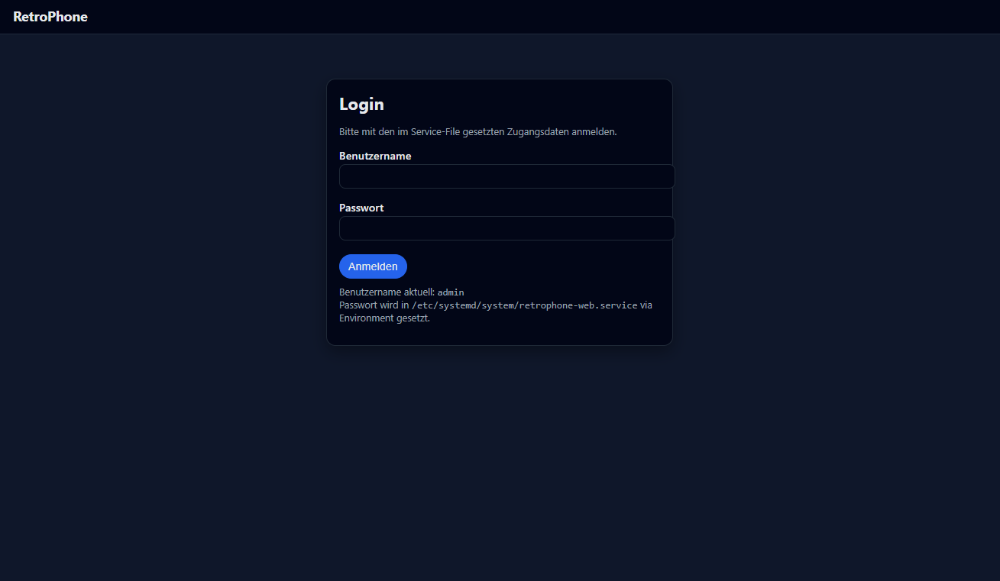
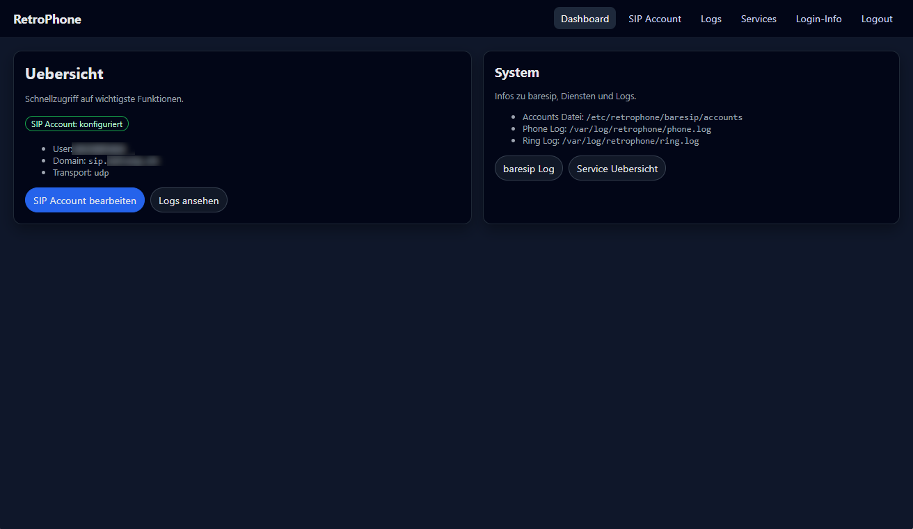
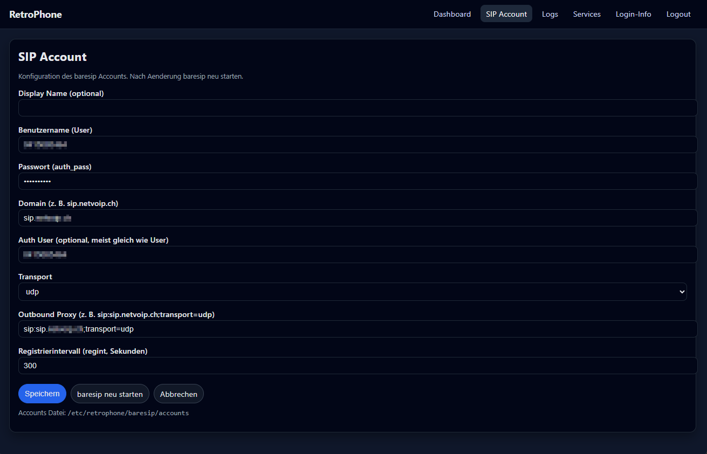
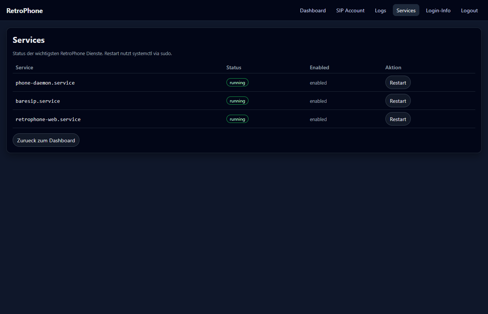

# ☎️ Retro Rotary SIP Phone  
**Convert a classic rotary dial phone into a working SIP VoIP phone using a Raspberry Pi Zero 2 W, Debian Trixie, Baresip and Python 3**

[](https://www.python.org/)
[](https://www.raspberrypi.com/)
[](https://flask.palletsprojects.com/)
[](LICENSE)

---

## 📚 Table of Contents

- [Overview](#-overview)
- [Features](#-features)
- [Hardware Setup](#-hardware-setup)
- [Software Installation](#-software-installation-step-by-step)
- [WLAN & Network Stability](#-wlan--network-stability)
- [Web Interface](#️-web-interface)
- [Log Files & Helper Tools](#-log-files--helper-tools)
- [Troubleshooting (Audio & SIP)](#-audio-troubleshooting)
- [Architecture Diagram](#-architecture-diagram-conceptual)
- [Credits & References](#-credits--references)
- [License](#-license)
- [Keywords & Support](#-keywords-for-discoverability)

---

## 🧭 Overview
This open-source project demonstrates how to interface **classic telephony hardware** — rotary dial, hook switch, and mechanical bells — with **modern VoIP systems**.  
Built on **Raspberry Pi Zero 2 W** running **Debian Trixie**, **Baresip**, and **Python 3**.

- 📞 Incoming / outgoing VoIP calls via Baresip  
- 🔔 Authentic mechanical ringing driven by GPIO  
- ⚙️ Pulse-dial decoding and SIP dialing  
- 🧠 Flask-based web interface for SIP, logs & services  
- 🔊 Dial-tone playback and full audio through USB headset  

---

## 🧩 Features

| Function | Description |
|------------------|------------------|
| ✅ Incoming calls | Mechanical bells ring; lifting handset answers |
| ✅ Outgoing calls | Rotary pulses decoded & sent to SIP |
| ✅ Dial tone | Analog-like dial tone playback |
| ✅ Web UI | Manage SIP, logs & restart services |
| ✅ GPIO monitoring | Check hook / dial / return contacts |
| ✅ Systemd services | Autostart & self-recovery |

---

## 🪛 Hardware Setup

This project uses an authentic rotary dial telephone combined with modern Raspberry Pi hardware.  
Below is the list of components used and verified to work with the current design.

### 🧩 Origin Story

The rotary phone used in this build wasn’t bought online — it was discovered in the **grandfather’s attic**, covered in dust but still mechanically perfect.  
After some careful cleaning and rewiring, the phone found a new life as a fully working SIP client.

### ⚙️ Required Components

| Component | Description | Link to buy
|------------------|------------------|------------------|
| ☎️ Old-style rotary telephone | The prototype uses a PTT **Modell 29**, found in the family attic. Any similar pulse-dial model will work. |
| 🥧 Raspberry Pi Zero 2W | Compact, low-power computer controlling GPIO and running the SIP stack. Any variant of the Zero 2 W will do. |
| 🔌 2x Dual D4184 MOSFET module | Used as high-current switches to drive the twin mechanical bell coils directly from the Pi GPIO pins. | 
| ⚡ 2 × 1N4007 diodes (1A / 1000V) | Wired in reverse across the bell coil outputs from the D4184 MOSFETs. These protect the switches from the voltage spike generated when the magnetic field in the coils collapses. **Ensure the band faces the positive line!** |
| 🔋 Power supply 12V → 35V | Boost converter used to power the mechanical bell coils. |
| 🔋 Power supply 12V → 5V | Step-down converter used to power the Raspberry Pi. |
| 🔌 12 V DC power adapter | Common supply feeding both converters above. |
| 🧠 Raspberry Pi GPIO breakout board | For clean wiring and to mount all discrete components safely. |
| 🎧 USB audio adapter or old USB Headset | Provides microphone and speaker ports for handset audio. |
| 🎧 Speaker and microphone | Provides microphone and speaker ports for handset audio. |
| 🔗 Micro-USB “On-The-Go” (OTG) cable | Connects the USB audio interface to the Raspberry Pi Zero 2 W. |

> The D4184 MOSFET module drives the two bell coils (RING_A and RING_B).  
> Each coil is protected by a 1N4007 diode, preventing reverse voltage damage when the magnetic field collapses.  
> A single 12 V power source feeds both the bell (via boost converter) and the Raspberry Pi (via step-down converter).

---

### 📈 Architecture & Wiring Diagram


Below is the complete wiring layout for the Retro Rotary SIP Phone hardware setup.  
It shows the Raspberry Pi Zero 2 W GPIO connections, MOSFET bell driver, diodes, and power converters.


> **Tip:** Open the image in full size to see all GPIO labels and wiring colors clearly.  
> **Ensure you double-check the polarity of the 1N4007 diodes and the MOSFET inputs before powering on.**

```
+--------------------------------------------------------------+
|                     Retro Rotary SIP Phone                   |
|--------------------------------------------------------------|
|  Rotary Dial  |  Hook Switch  |  Bell Coils  |  USB Audio    |
|--------------------------------------------------------------|
|    GPIO 23    |    GPIO 18    |  GPIO 17/27  | Logitech H340 |
|               |               |              |    Headset    |
|--------------------------------------------------------------|
|  phone_daemon.py (Pulse/Hooks)  -> baresip (SIP stack)       |
|  ring_control.py (Bells)         -> GPIO Driver              |
|  webapp.py (Flask UI)            -> SIP + Logs + Control     |
+--------------------------------------------------------------+
```

---

### 🔩 GPIO Mapping Summary

| Signal | GPIO (BCM) | Description | Logic |
|---------|-------------|-------------|--------|
| HOOK | 18 | Handset switch | 0 = off-hook  1 = on-hook |
| PULSE | 23 | Rotary dial pulses | 1 = pulse active |
| POS1 | 24 | Dial return contact | 0 = dial turning |
| RING_A | 17 | Bell coil A | controlled by `ring_control.py` |
| RING_B | 27 | Bell coil B | controlled by `ring_control.py` |

> The original Swiss pulse-dial logic pulls to GND — no external pull-down resistors needed.

---

## ⚙️ Software Installation (Step by Step)

### 1️⃣ Base System

Minimal Debian Trixie / Bookworm Lite.  
Enable SSH and network.

### 2️⃣ Dependencies

```bash
sudo apt-get update
sudo apt-get upgrade -y
sudo apt-get install -y \  python3 python3-pip python3-flask python3-gpiozero python3-rpi.gpio \  alsa-utils sox git \  build-essential libasound2-dev libssl-dev libz-dev libopus-dev libavformat-dev \  libavcodec-dev libavutil-dev libre-dev libspandsp-dev libreadline-dev \  uuid-dev libedit-dev libmicrohttpd-dev systemd python3-venv \ baresip libasound2
```

---

### 3️⃣ Create folders for **retrophone** and **baresip**

```bash
sudo mkdir -p /etc/retrophone/baresip
sudo mkdir -p /usr/local/retrophone
sudo mkdir -p /var/log/retrophone
```

Run once to generate default config:

```bash
baresip
# CTRL+C to exit
```

### 4️⃣ Configure baresip

**Create the initial config-file for baresip**
Edit `/etc/retrophone/baresip/config`:

```bash
sudo tee /etc/retrophone/baresip/config >/dev/null <<'EOF'
# UI Modules
module                  stdio.so
module                  httpd.so

# Audio driver Modules
module                  alsa.so

# Media NAT modules
module                  stun.so
module                  turn.so
module                  ice.so

#------------------------------------------------------------------------------
# Temporary Modules (loaded then unloaded)

module_tmp              uuid.so
module_tmp              account.so


#------------------------------------------------------------------------------
# Application Modules

module_app              auloop.so
module_app              contact.so
module_app              debug_cmd.so
module_app              menu.so
module_app              ctrl_tcp.so
module_app              vidloop.so

#------------------------------------------------------------------------------
# Module parameters


# UI Modules parameters
cons_listen             0.0.0.0:5555 # cons - Console UI UDP/TCP sockets

http_listen             127.0.0.1:8000 # httpd - HTTP Server

ctrl_tcp_listen         127.0.0.1:4444 # ctrl_tcp - TCP interface JSON

evdev_device            /dev/input/event0

# Opus codec parameters
opus_bitrate            28000 # 6000-510000

vumeter_stderr          yes

# Selfview
video_selfview          window # {window,pip}

# Menu
ring_aufile             none
EOF

**Create config file for the useraccount**
Edit `/etc/retrophone/baresip/accounts`:
### 2️⃣ Make it permanent (NetworkManager method)
```bash
sudo tee /etc/retrophone/baresip/accounts >/dev/null <<'EOF'
; YOUR ACCOUNT
<sip:phonenumber@sip.domain.url>;auth_user=USERNAME;auth_pass=YOUR_PASSWORD;outbound="sip:sip.domain.url;transport=udp";regint=300
sudo tee /etc/NetworkManager/conf.d/wifi-powersave-off.conf >/dev/null <<'EOF'
[connection]
wifi.powersave = 2
EOF
```

---

### 5️⃣ Directory Structure

```bash
sudo mkdir -p /usr/local/retrophone /var/log/retrophone /run/retrophone
sudo chown -R pi:pi /usr/local/retrophone /var/log/retrophone /run/retrophone
```

Copy all Python files:

```bash
sudo cp gpio_monitor.py gpio_hook_monitor.py ring_control.py phone_daemon.py webapp.py /usr/local/retrophone/
sudo chmod +x /usr/local/retrophone/*.py
```

---

### 6️⃣ Create a Dial Tone

```bash
sox -n -r 8000 -c 1 /usr/local/retrophone/dialtone.wav synth 10 sin 425
```

---

### 7️⃣ Sudo Permissions

```bash
sudo visudo
```

Add:

```text
pi ALL=(ALL) NOPASSWD: /usr/bin/systemctl restart baresip.service
pi ALL=(ALL) NOPASSWD: /usr/bin/systemctl restart phone-daemon.service
pi ALL=(ALL) NOPASSWD: /usr/bin/systemctl restart retrophone-web.service
```

Permission for the webapp to change usernames in the account-file
```bash
sudo chown -R pi:pi /etc/retrophone/baresip
sudo chmod 640 /etc/retrophone/baresip/accounts
sudo systemctl restart NetworkManager
```

---

### 8️⃣ Systemd Services

#### 📞 `/etc/systemd/system/phone-daemon.service`
Edit `/etc/rc.local` and add before `exit 0`:
```bash
sudo tee /etc/systemd/system/phone-daemon.service >/dev/null <<'EOF'
[Unit]
Description=RetroPhone Dial/Hook Daemon
After=network.target sound.target baresip.service

[Service]
ExecStart=/usr/bin/python3 /usr/local/retrophone/phone_daemon.py
Restart=on-failure
User=pi
Group=pi
NoNewPrivileges=false

[Install]
WantedBy=multi-user.target
EOF

sudo systemctl daemon-reload
sudo systemctl enable --now phone-daemon.service

```

#### 🔔 `/etc/systemd/system/retrophone-web.service`
```bash
sudo tee /etc/systemd/system/retrophone-web.service >/dev/null <<'EOF'
[Unit]
Description=RetroPhone Web UI
After=network.target

[Service]
ExecStart=/usr/bin/python3 /usr/local/retrophone/webapp.py
WorkingDirectory=/usr/local/retrophone
User=pi
Group=pi
Environment=RETRO_WEB_USER=admin
Environment=RETRO_WEB_PASS=secret
Restart=on-failure
NoNewPrivileges=false

[Install]
WantedBy=multi-user.target
EOF

sudo systemctl daemon-reload
sudo systemctl enable --now retrophone-web.service

```

#### 📡 `/etc/systemd/system/baresip.service`
Edit `/etc/systemd/system/baresip.service`:

```bash
sudo tee /etc/systemd/system/baresip.service >/dev/null <<'EOF'
[Unit]
Description=baresip SIP client
After=network-online.target
Wants=network-online.target

[Service]
Type=simple
ExecStart=/usr/bin/baresip -f /etc/retrophone/baresip
Restart=always
RestartSec=2
# Root ist ok für GPIO-Setup und einfachen Start; alternativ eigenen User anlegen.
User=root

[Install]
WantedBy=multi-user.target
EOF

sudo systemctl daemon-reload
sudo systemctl enable --now baresip.service

```


## 🖥️ Web Interface
Accessible at `http://<raspberrypi-ip>:8080`  

**Features**
- Edit SIP accounts  
- View logs (auto-refresh)  
- Restart services  
- Check service status (baresip / daemon / web)  

Credentials set via `retrophone-web.service` environment variables.

<p align="center">
  <a href="media/webapp_login.png" target="_blank">
    
  </a>
  <a href="media/webapp_dashboard_1.png" target="_blank">
    
  </a>
<a href="media/webapp_sip_account.png" target="_blank">
    
</a>
<a href="media/webapp_services.png" target="_blank">
    
  </a>
</p>

<p align="center"><em>Click any image to view full size in a new tab.</em></p>

---

## 🧾 Log Files

## 🧾 Log Files & Helper Tools
| Path | Description |
|------|--------------|
| `tail -f /var/log/retrophone/phone.log` | Main rotary daemon (dial, hook, call states) |
| `tail -f /var/log/retrophone/ring.log` | Bell control |
| `journalctl -u baresip` | baresip SIP logs |

### 🆘 Helperscripts
| Script | Function |
|------------------|------------------|
| `gpio_monitor.py` | Show live GPIO states |
| `gpio_hook_monitor.py` | Hook only |
| `ring_control.py` | Manual ring test |
- Check service status (baresip / daemon / web)  

---

### 📝 Configure logrotate

```bash
sudo tee /etc/logrotate.d/retrophone >/dev/null <<'EOF'
/var/log/retrophone/*.log {
    daily
    rotate 14
    compress
    missingok
    notifempty
    create 0640 root root
    sharedscripts
    postrotate
        systemctl kill -s HUP phone-daemon.service 2>/dev/null || true
    endscript
}
EOF
```

---

## 📡 WLAN & Network Stability
The **Raspberry Pi Zero 2 W** uses the **Broadcom brcmfmac** Wi-Fi driver, which by default enables **power-saving**.  
During idle phases this can cause 🔻 lost SIP registrations, dropped Flask sessions, or temporary SSH timeouts.

### 1️⃣ Temporarily disable Power Save
```bash
sudo iw dev wlan0 set power_save off
```

### 2️⃣ Make it permanent (NetworkManager method)
```bash
sudo tee /etc/NetworkManager/conf.d/wifi-powersave-off.conf >/dev/null <<'EOF'
[connection]
wifi.powersave = 2
EOF

sudo systemctl restart NetworkManager
```

### 3️⃣ Without NetworkManager (Raspberry Pi OS Lite)
Edit `/etc/rc.local` and add before `exit 0`:
```bash
iw dev wlan0 set power_save off
```

### 4️⃣ Driver tuning for brcmfmac
```bash
sudo rmmod brcmfmac
sudo modprobe brcmfmac roamoff=1 feature_disable=0x82000
```

### 5️⃣ Firmware update
```bash
sudo apt install --reinstall firmware-brcm80211 -y
```

### 6️⃣ Verify
```bash
iw wlan0 get power_save
# Expected → Power save: off
```

✅ This completely stabilizes Wi-Fi connections for 24/7 operation — essential for baresip, the phone daemon and the web UI.

---


## 🎧 Audio Troubleshooting
If baresip reports `Unknown error -22`, check your ALSA config:
```text
audio_player alsa,plughw:0,0
audio_source alsa,plughw:0,0
audio_alert alsa,null
audio_srate 48000
```
Playback test:
```bash
aplay -D plughw:0,0 /usr/local/retrophone/dialtone.wav
```

---


## 🧠 Credits & References
- Electronics and wiring inspired by [CrazyRobMiles / RaspberryPi-DialTelephone](https://github.com/CrazyRobMiles/RaspberryPi-DialTelephone)  
- VoIP engine [baresip](https://github.com/baresip/baresip)  
- Community resources: [baresip Discussions](https://github.com/baresip/baresip/discussions) · [r/raspberry_pi](https://reddit.com/r/raspberry_pi)

---

### 🪪 License
Released under the **MIT License**.  
Third-party components retain their original licenses.

---

### 🔎 Keywords for Discoverability
Retro rotary phone Raspberry Pi • Raspberry Pi Zero 2 W SIP phone • baresip python integration • GPIO pulse dialing • retro VoIP hardware project • mechanical bell driver • Flask web UI • Debian Trixie Raspberry Pi • DIY vintage telephone • embedded Linux telephony

---

### ⭐ Support & Collaboration
If you're a fan of vintage hardware and open-source telephony, give this project a star on GitHub or share your own build via a pull request or issue!
And if you enjoyed this project or found it helpful in setting up your own retro phone, you can buy me a coffee to help keep the bells ringing and the code flowing. ☕👇  

[](https://buymeacoffee.com/ckronenbere)
