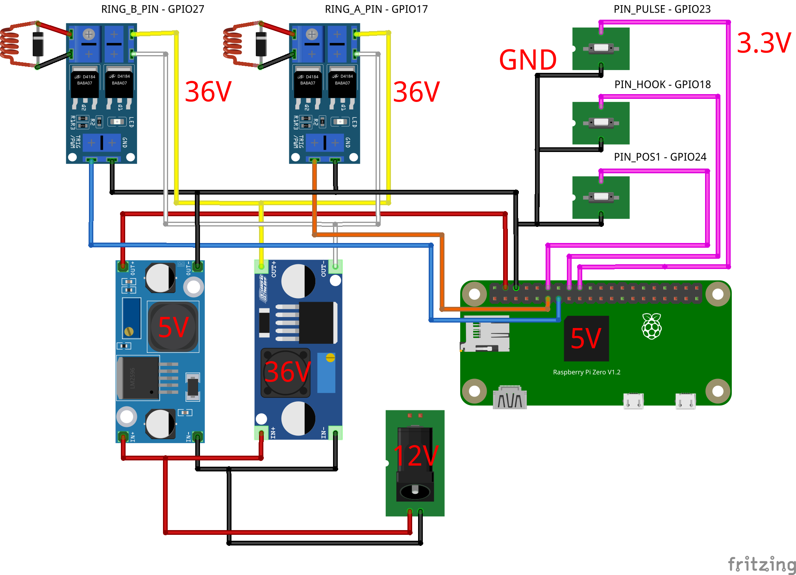

# ☎️ Retro Rotary SIP Phone  
**Convert a classic rotary dial phone into a working SIP VoIP phone using a Raspberry Pi Zero 2 W, Debian Trixie, Baresip and Python 3**

[](https://www.python.org/)
[](https://www.raspberrypi.com/)
[](https://flask.palletsprojects.com/)
[](LICENSE)

---

## 📚 Table of Contents

- [Overview](#-overview)
- [Features](#-features)
- [Hardware Setup](#-hardware-setup)
- [Software Installation](#-software-installation-step-by-step)
- [WLAN & Network Stability](#-wlan--network-stability)
- [Web Interface](#️-web-interface)
- [Log Files & Helper Tools](#-log-files--helper-tools)
- [Troubleshooting (Audio & SIP)](#-audio-troubleshooting)
- [Architecture Diagram](#-architecture-diagram-conceptual)
- [Credits & References](#-credits--references)
- [License](#-license)
- [Keywords & Support](#-keywords-for-discoverability)

---

## 🧭 Overview
This open-source project demonstrates how to interface **classic telephony hardware** — rotary dial, hook switch, and mechanical bells — with **modern VoIP systems**.  
Built on **Raspberry Pi Zero 2 W** running **Debian Trixie**, **Baresip**, and **Python 3**.

- 📞 Incoming / outgoing VoIP calls via Baresip  
- 🔔 Authentic mechanical ringing driven by GPIO  
- ⚙️ Pulse-dial decoding and SIP dialing  
- 🧠 Flask-based web interface for SIP, logs & services  
- 🔊 Dial-tone playback and full audio through USB headset  

---

## 🧩 Features

| Function | Description |
|------------------|------------------|
| ✅ Incoming calls | Mechanical bells ring; lifting handset answers |
| ✅ Outgoing calls | Rotary pulses decoded & sent to SIP |
| ✅ Dial tone | Analog-like dial tone playback |
| ✅ Web UI | Manage SIP, logs & restart services |
| ✅ GPIO monitoring | Check hook / dial / return contacts |
| ✅ Systemd services | Autostart & self-recovery |

---

## 🪛 Hardware Setup

This project uses an authentic rotary dial telephone combined with modern Raspberry Pi hardware.  
Below is the list of components used and verified to work with the current design.

### 🧩 Origin Story

The rotary phone used in this build wasn’t bought online — it was discovered in the **grandfather’s attic**, covered in dust but still mechanically perfect.  
After some careful cleaning and rewiring, the phone found a new life as a fully working SIP client.

### ⚙️ Required Components

| Component | Description |
|------------------|------------------|
| ☎️ Old-style rotary telephone | The prototype uses a PTT **Modell 29**, found in the family attic. Any similar pulse-dial model will work. |
| 🥧 Raspberry Pi Zero 2W | Compact, low-power computer controlling GPIO and running the SIP stack. Any variant of the Zero 2 W will do. |
| 🔌 Dual D4184 MOSFET module | Used as high-current switches to drive the twin mechanical bell coils directly from the Pi GPIO pins. |
| ⚡ 2 × 1N4007 diodes (1A / 1000V) | Wired in reverse across the bell coil outputs from the D4184 MOSFETs. These protect the switches from the voltage spike generated when the magnetic field in the coils collapses. **Ensure the band faces the positive line!** |
| 🔋 Power supply 12V → 35V | Boost converter used to power the mechanical bell coils. |
| 🔋 Power supply 12V → 5V | Step-down converter used to power the Raspberry Pi. |
| 🔌 12 V DC power adapter | Common supply feeding both converters above. |
| 🧠 Raspberry Pi GPIO breakout board | For clean wiring and to mount all discrete components safely. |
| 🎧 USB audio adapter | Provides microphone and speaker ports for handset audio. |
| 🔗 Micro-USB “On-The-Go” (OTG) cable | Connects the USB audio interface to the Raspberry Pi Zero 2 W. |

> The D4184 MOSFET module drives the two bell coils (RING_A and RING_B).  
> Each coil is protected by a 1N4007 diode, preventing reverse voltage damage when the magnetic field collapses.  
> A single 12 V power source feeds both the bell (via boost converter) and the Raspberry Pi (via step-down converter).

---

### 📈 Wiring Diagram

Below is the complete wiring layout for the Retro Rotary SIP Phone hardware setup.  
It shows the Raspberry Pi Zero 2 W GPIO connections, MOSFET bell driver, diodes, and power converters.



> **Tip:** Open the image in full size to see all GPIO labels and wiring colors clearly.  
> **Ensure you double-check the polarity of the 1N4007 diodes and the MOSFET inputs before powering on.**

---

### 🔩 GPIO Mapping Summary

| Signal | GPIO (BCM) | Description | Logic |
|---------|-------------|-------------|--------|
| HOOK | 18 | Handset switch | 0 = off-hook  1 = on-hook |
| PULSE | 23 | Rotary dial pulses | 1 = pulse active |
| POS1 | 24 | Dial return contact | 0 = dial turning |
| RING_A | 17 | Bell coil A | controlled by `ring_control.py` |
| RING_B | 27 | Bell coil B | optional, for dual-coil bells |

> The original Swiss pulse-dial logic pulls to GND — no external pull-down resistors needed.

---

## ⚙️ Software Installation (Step by Step)
*(Keep your detailed setup commands and systemd service definitions here — they are already correct in your current repo.)*

---

## 📡 WLAN & Network Stability
The **Raspberry Pi Zero 2 W** uses the **Broadcom brcmfmac** Wi-Fi driver, which by default enables **power-saving**.  
During idle phases this can cause 🔻 lost SIP registrations, dropped Flask sessions, or temporary SSH timeouts.

### 1️⃣ Temporarily disable Power Save
```bash
sudo iw dev wlan0 set power_save off
```

### 2️⃣ Make it permanent (NetworkManager method)
```bash
sudo tee /etc/NetworkManager/conf.d/wifi-powersave-off.conf >/dev/null <<'EOF'
[connection]
wifi.powersave = 2
EOF

sudo systemctl restart NetworkManager
```

### 3️⃣ Without NetworkManager (Raspberry Pi OS Lite)
Edit `/etc/rc.local` and add before `exit 0`:
```bash
iw dev wlan0 set power_save off
```

### 4️⃣ Driver tuning for brcmfmac
```bash
sudo rmmod brcmfmac
sudo modprobe brcmfmac roamoff=1 feature_disable=0x82000
```

### 5️⃣ Firmware update
```bash
sudo apt install --reinstall firmware-brcm80211 -y
```

### 6️⃣ Verify
```bash
iw wlan0 get power_save
# Expected → Power save: off
```

✅ This completely stabilizes Wi-Fi connections for 24/7 operation — essential for baresip, the phone daemon and the web UI.

---

## 🖥️ Web Interface
Accessible at `http://<raspberrypi-ip>:8080`  

**Features**
- Edit SIP accounts  
- View logs (auto-refresh)  
- Restart services  
- Check service status (baresip / daemon / web)  

Credentials set via `retrophone-web.service` environment variables.

---

## 🧾 Log Files & Helper Tools
| File | Purpose |
|------------------|------------------|
| `/var/log/retrophone/phone.log` | Main daemon (dial, hook, call state) |
| `/var/log/retrophone/ring.log` | Bell control |
| `journalctl -u baresip` | baresip logs |

**Helper scripts**
| Script | Function |
|------------------|------------------|
| `gpio_monitor.py` | Show live GPIO states |
| `gpio_hook_monitor.py` | Hook only |
| `ring_control.py` | Manual ring test |

---

## 🎧 Audio Troubleshooting
If baresip reports `Unknown error -22`, check your ALSA config:
```text
audio_player alsa,plughw:0,0
audio_source alsa,plughw:0,0
audio_alert alsa,null
audio_srate 48000
```
Playback test:
```bash
aplay -D plughw:0,0 /usr/local/retrophone/dialtone.wav
```

---

## 🔬 Architecture Diagram (conceptual)
```
+--------------------------------------------------------------+
|                     Retro Rotary SIP Phone                   |
|--------------------------------------------------------------|
|  Rotary Dial  |  Hook Switch  |  Bell Coils  |  USB Audio    |
|--------------------------------------------------------------|
|    GPIO 23    |    GPIO 18    |  GPIO 17/27  | Logitech H340 |
|               |               |              |    Headset    |
|--------------------------------------------------------------|
|  phone_daemon.py (Pulse/Hooks)  -> baresip (SIP stack)       |
|  ring_control.py (Bells)         -> GPIO Driver              |
|  webapp.py (Flask UI)            -> SIP + Logs + Control     |
+--------------------------------------------------------------+
```

---

## 🧠 Credits & References
- Inspired by [CrazyRobMiles / RaspberryPi-DialTelephone](https://github.com/CrazyRobMiles/RaspberryPi-DialTelephone)  
- VoIP engine [baresip](https://github.com/baresip/baresip)  
- Community resources: [baresip Discussions](https://github.com/baresip/baresip/discussions) · [r/raspberry_pi](https://reddit.com/r/raspberry_pi)

---

## 🪪 License
Released under the **MIT License**.  
Third-party components retain their original licenses.

---

## 🔎 Keywords for Discoverability
Retro rotary phone Raspberry Pi • Raspberry Pi Zero 2 W SIP phone • baresip python integration • GPIO pulse dialing • retro VoIP hardware project • mechanical bell driver • Flask web UI • Debian Trixie Raspberry Pi • DIY vintage telephone • embedded Linux telephony

---

## ⭐ Support & Collaboration
If you love vintage hardware and open-source telephony, give this project a ⭐ on GitHub or share your own build via pull request or issue!
